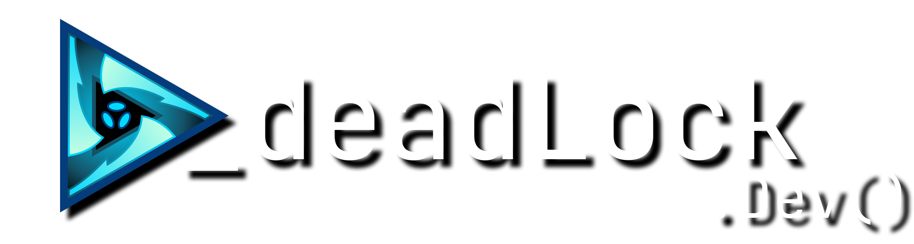

  

> *Where industrial expertise meets creative innovation*

We're a flexible group of developers bridging two worlds: **CNC machining & automation** by day, **games & creative tools** by night. Our industrial background in manufacturing gives us a unique perspective on building robust, real-world solutions.

## 🛠️ What We Build
- **🎮 Games & Interactive Tools** for the community
- **⚙️ Industrial Solutions** for manufacturing & automation  
- **🌐 Web Applications** and modern interfaces
- **🔧 Utilities** that solve real problems

**Tech Stack:** .NET • C# • TypeScript • React • C++ • Python • and more

## 🌐 Learn More

**[🚀 Visit Our Website](https://deadlockdevelopment.github.io/about/)**

---

*From factory floors to gaming worlds – we build what matters* ⚡